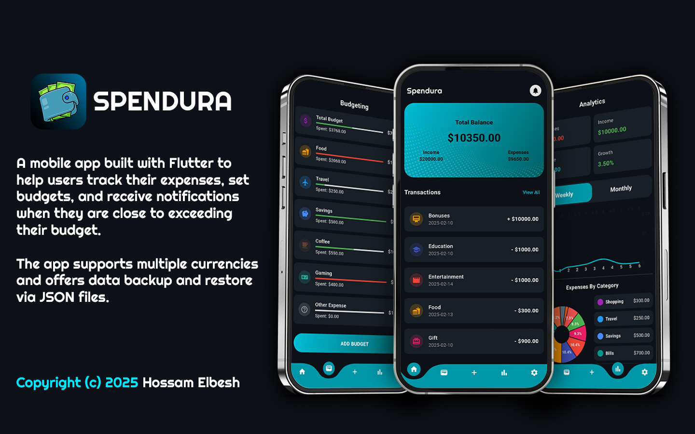

# Spendura App

A mobile app built with Flutter to help users track their expenses, set budgets, and receive notifications when they are close to exceeding their budget. The app supports multiple currencies and offers data backup and restore via JSON files.

## Features

- **Track Expenses**: Record your expenses or income by selecting categories (e.g., Food, Transport, Entertainment).
- **Category-based View**: View expenses grouped by categories, with visual indicators to track progress.
- **Currency Support**: Choose your preferred currency, with dynamic symbol display.
- **Onboarding Screen**: A brief introduction to the app for first-time users.
- **Dark Mode**: A visually appealing dark theme.
- **SQLite Integration**: Stores data locally using SQLite for efficient and persistent storage.
- **Push Notifications**: Get notifications when your budget is near or has been exceeded.
- **Backup and Restore Data**: Export and import app data (including transactions, budgets, and user settings) as a JSON file from the settings screen for backup and transfer.

## Technologies Used

- **Flutter**: The framework used to build the app.
- **SQLite**: Local database to store transactions and budget data.
- **SharedPreferences**: To store user preferences (username, currency, etc.).
- **flutter_local_notifications**: For handling push notifications when budget thresholds are reached.
- **Image Picker**: For selecting user profile images.
- **File Picker**: For exporting and importing data via JSON files.
- **Path Provider**: To get the correct file path for exporting or importing data.

## Getting Started

This project is a starting point for a Flutter application.

A few resources to get you started if this is your first Flutter project:

- [Lab: Write your first Flutter app](https://docs.flutter.dev/get-started/codelab)
- [Cookbook: Useful Flutter samples](https://docs.flutter.dev/cookbook)

For help getting started with Flutter development, view the
[online documentation](https://docs.flutter.dev/), which offers tutorials,
samples, guidance on mobile development, and a full API reference.
